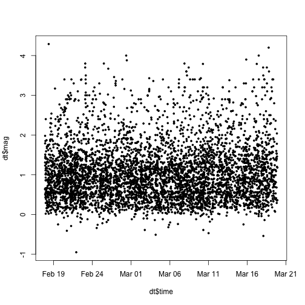
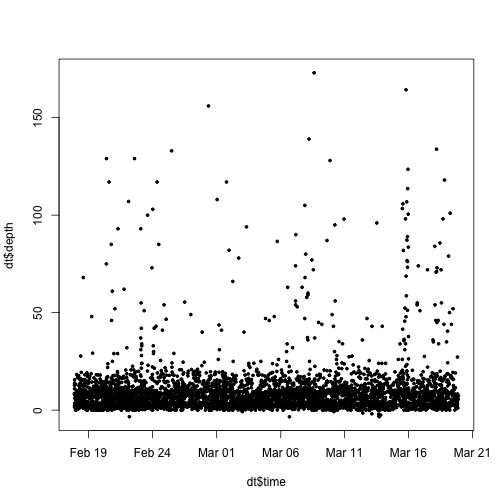
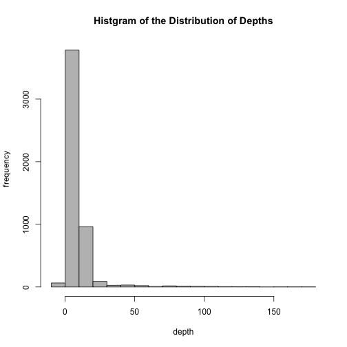
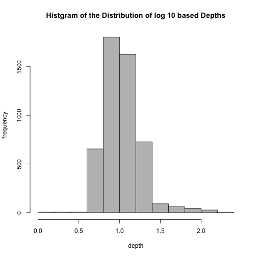
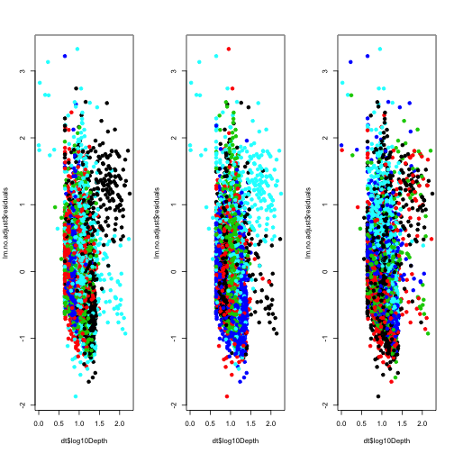
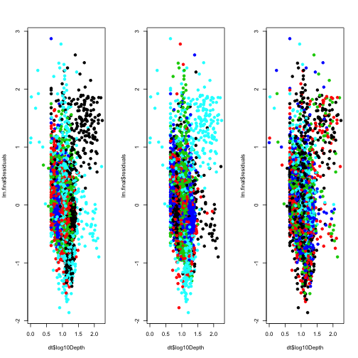

# Regression Modeling and Analysis of Earthquakes  
## Kecheng Xu  
## March 19, 2015 

## Preliminaries

### Load libraries/data/create new variables

```r
library(Hmisc)
```

```
## Warning: package 'Hmisc' was built under R version 3.1.2
```

```
## Loading required package: grid
## Loading required package: lattice
```

```
## Warning: package 'lattice' was built under R version 3.1.2
```

```
## Loading required package: survival
## Loading required package: splines
## Loading required package: Formula
```

```
## Warning: package 'Formula' was built under R version 3.1.2
```

```
## Loading required package: ggplot2
## 
## Attaching package: 'Hmisc'
## 
## The following objects are masked from 'package:base':
## 
##     format.pval, round.POSIXt, trunc.POSIXt, units
```

```r
data=read.csv('../data/all_month.csv',sep=",",header=TRUE)
dt=data[complete.cases(data),] ## remove the rows containing missing values
dt=subset(dt,dt$type=='earthquake')
dt$latCut <- cut2(dt$latitude, g = 5)
dt$lonCut <- cut2(dt$longitude, g = 5)
dt$nstCut <- cut2(dt$nst, g = 5)
dt$log10Depth <- log10(dt$depth-min(dt$depth)+1)
dt$time=as.character(dt$time)
day=substr(dt$time,1,10)
hour=substr(dt$time,12,19)
new.time=paste(day,hour)
dt$time=strptime(new.time,format="%Y-%m-%d %H:%M:%S")
summary(dt)
```
------

## Exploratory analysis

### Get minimum and maximum times and date downloaded (Methods/Data Collection)

```r
summary(dt$time)
```

```
##                  Min.               1st Qu.                Median 
## "2015-02-17 21:41:24" "2015-02-24 15:46:19" "2015-03-04 06:43:14" 
##                  Mean               3rd Qu.                  Max. 
## "2015-03-04 05:33:17" "2015-03-11 07:11:59" "2015-03-19 21:27:29" 
##                  NA's 
##                   "8"
```

### Look at patterns over time (Results paragraph 1)

```r
plot(dt$time, dt$mag, pch = 19,cex=0.5)
```

 

```r
plot(dt$time, dt$depth, pch = 19,cex=0.5)
```

 

There does not appear to be a time trend in either variable. 


### Look at distribution of magnitudes (Results paragraph 2)

```r
mean(dt$mag < 3)
```

```
## [1] 0.9788
```

```r
mean(dt$mag > 3 & dt$mag < 5)
```

```
## [1] 0.01862
```
Most earthquakes are small (< 3) or medium (>3 and < 5)

### Look at distribution of depths (Results paragraph 2)


```r
hist(dt$depth, col = "grey",main="Histgram of the Distribution of Depths",
     xlab="depth",ylab="frequency")
```

 

```r
hist(dt$log10Depth, col = "grey",main="Histgram of the Distribution of log 10 based Depths",
     xlab="depth",ylab="frequency")
```

 

-------

## Modeling 

### Fit a model with no adjustment (results - paragraph 3)


```r
# Fit model with no adjustment variable
lm.no.adjust <- lm(dt$mag ~ dt$log10Depth)

# Plot residuals, colored by different variables (latitude, longitude, number of sites observing the quake)
par(mfrow = c(1, 3))
plot(dt$log10Depth, lm.no.adjust$residuals, col = dt$latCut, pch = 19)
plot(dt$log10Depth, lm.no.adjust$residuals, col = dt$lonCut, pch = 19)
plot(dt$log10Depth, lm.no.adjust$residuals, col = dt$nstCut, pch = 19)
```

 
It appears there are some non-random patterns here.


### Now fit a model with factor adjustment for latitude, longitude, and number of sites (results - paragraph 3)


```r
lm.final <- lm(dt$mag ~ dt$log10Depth + dt$latCut + dt$lonCut + dt$nst)

par(mfrow = c(1, 3))
plot(dt$log10Depth, lm.final$residuals, col = dt$latCut, pch = 19)
plot(dt$log10Depth, lm.final$residuals, col = dt$lonCut, pch = 19)
plot(dt$log10Depth, lm.final$residuals, col = dt$nstCut, pch = 19)
```

 

## Get the estimates and confidence intervals


```r
## The estimate from summary
summary(lm.final)
```

```
## 
## Call:
## lm(formula = dt$mag ~ dt$log10Depth + dt$latCut + dt$lonCut + 
##     dt$nst)
## 
## Residuals:
##     Min      1Q  Median      3Q     Max 
## -1.8581 -0.3626 -0.0416  0.2825  2.8726 
## 
## Coefficients:
##                       Estimate Std. Error t value Pr(>|t|)    
## (Intercept)          -0.369993   0.073294   -5.05  4.6e-07 ***
## dt$log10Depth         0.814160   0.041665   19.54  < 2e-16 ***
## dt$latCut[34.0,37.1)  0.317593   0.032360    9.81  < 2e-16 ***
## dt$latCut[37.1,38.8)  0.140646   0.035874    3.92  9.0e-05 ***
## dt$latCut[38.8,39.4)  0.110816   0.047417    2.34   0.0195 *  
## dt$latCut[39.4,66.3]  0.443419   0.036018   12.31  < 2e-16 ***
## dt$lonCut[-123,-121) -0.086120   0.032861   -2.62   0.0088 ** 
## dt$lonCut[-121,-118)  0.091190   0.035247    2.59   0.0097 ** 
## dt$lonCut[-118,-117) -0.245883   0.040734   -6.04  1.7e-09 ***
## dt$lonCut[-117, 178]  0.423671   0.041145   10.30  < 2e-16 ***
## dt$nst                0.018671   0.000644   28.99  < 2e-16 ***
## ---
## Signif. codes:  0 '***' 0.001 '**' 0.01 '*' 0.05 '.' 0.1 ' ' 1
## 
## Residual standard error: 0.582 on 5038 degrees of freedom
## Multiple R-squared:  0.317,	Adjusted R-squared:  0.316 
## F-statistic:  234 on 10 and 5038 DF,  p-value: <2e-16
```

```r
## The confidence interval from confint
confint(lm.final)
```

```
##                         2.5 %   97.5 %
## (Intercept)          -0.51368 -0.22631
## dt$log10Depth         0.73248  0.89584
## dt$latCut[34.0,37.1)  0.25415  0.38103
## dt$latCut[37.1,38.8)  0.07032  0.21097
## dt$latCut[38.8,39.4)  0.01786  0.20377
## dt$latCut[39.4,66.3]  0.37281  0.51403
## dt$lonCut[-123,-121) -0.15054 -0.02170
## dt$lonCut[-121,-118)  0.02209  0.16029
## dt$lonCut[-118,-117) -0.32574 -0.16603
## dt$lonCut[-117, 178]  0.34301  0.50433
## dt$nst                0.01741  0.01993
```


